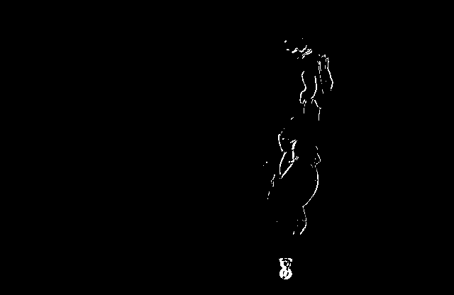
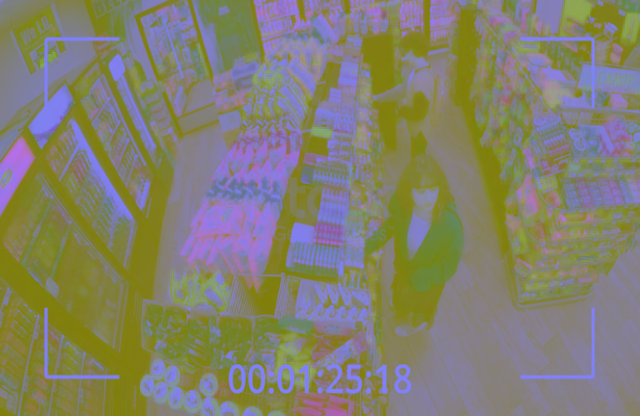
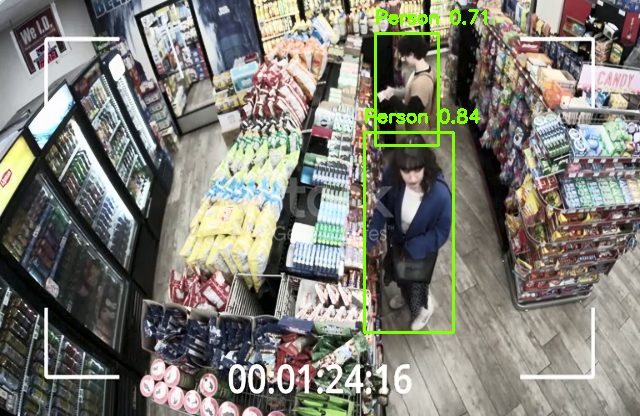

### Atualização de projeto de detecção de pessoas
- Protocol Buffers e compilação de .proto não são mais necessários
- Troca de modelo do TF para modelo do Ultralytics
- O modelo não é mais baixado manualmente
- Não é mais necessário carregar arquivo label_map para rotulagem

### Funcionamento atual:
- O modelo é carregado automaticamente com Ultralytics
- É verificado se está havendo movimento no cenário:

- Em dseguida aplicado a equalização de histograma para melhorar a detecção

- O modelo faz a detecção filtrando a classe 0 (zero) do dataset COCO, sendo Person, retornando as coordenadas para desenho da Bounding Box e a confiança da detecção acima de 70%

### Uso:
- `pip install ultralytics opencv-python` ou  `pip install -r requirements.txt`

- `python3 person_detect.py`

### Estrutura:
<b>
object_detection/ 
      │
   ├── person_detect.py 

      ├── video.mp4 

      ├── requirements.txt 

      └── README.md
</b>